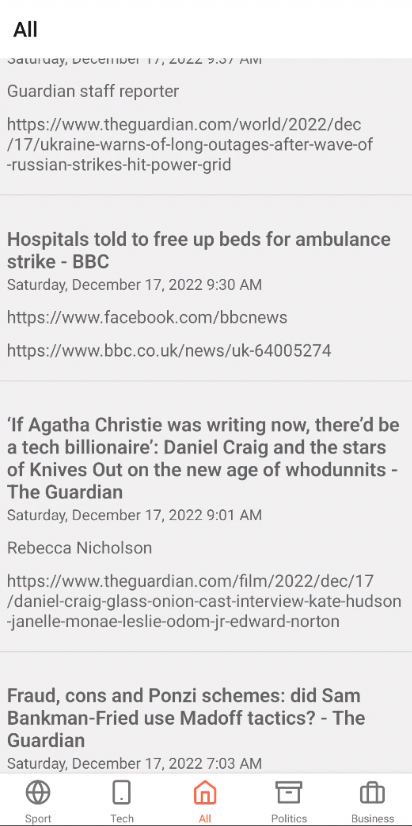

## Untitld News App
## 

The following is a react native app I developed to re-fresh my react native skills. I followed the below tutorial here: 

https://www.freecodecamp.org/news/build-an-android-news-app-with-react-native-and-native-base/

## Learnings

- I learned how to set up tab navigation using react native navigator.
- I learned how to set up config files and call an API from within react native
- I learned how to use FlatList to output a JSON array into article cards.
- I learned how to use the spinner to show loading articles 

## Cool packages used 

- Moment js was used to format the dates
- react navigation was used to create the navigation tabs
- Native base was used for the components (spinner, flatlist, divider)

## Challenges
- My biggest challenge was creating icons in the react navigator tabs. When I inserted an Icon the tab showed an icon not found result. I tried multiple icon libraries (feather/material/fontawesome) and had the same problem. 
- Upon investigation the android build code was not linking to the icons. To solve it I had to edit the build gradle file in the android code and rebuild the project. Upon which the icons began displaying. 
- See fix here: https://www.npmjs.com/package/react-native-vector-icons#android

## To do: 

1. Style project nicer
2. Add search functionality
3. Add saved articles functionality either with an account creation or with offline data persistence. 
